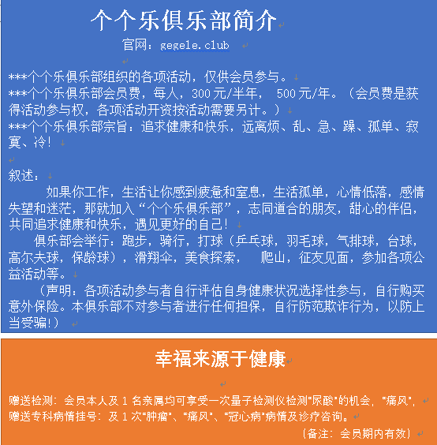
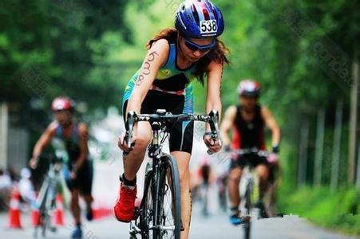
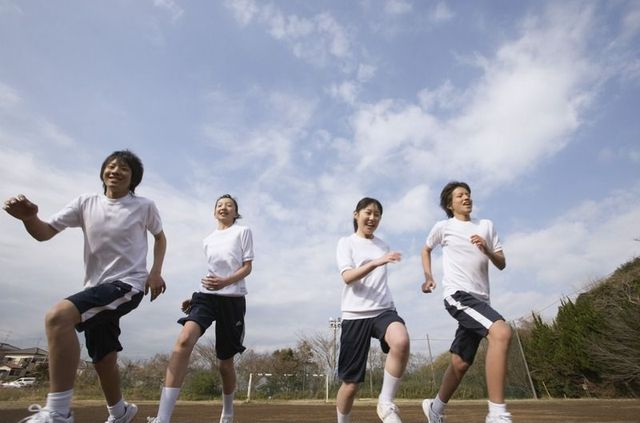
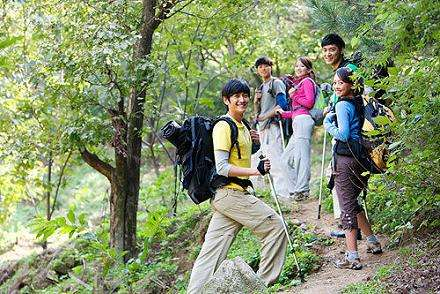
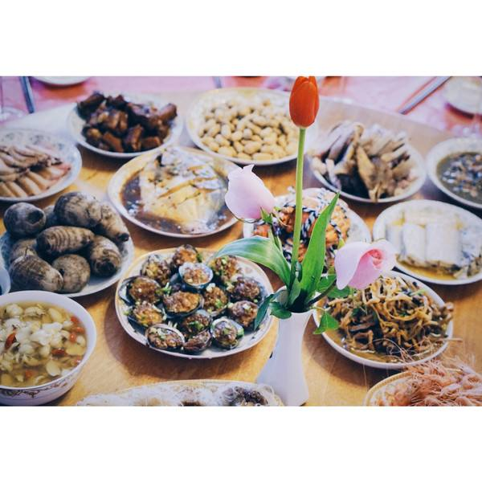
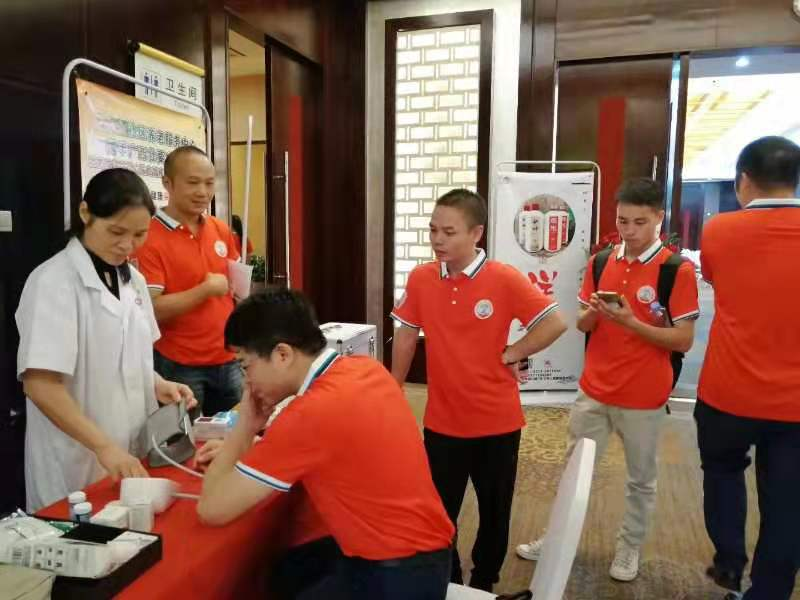

# 个个乐俱乐部

## ***个个乐俱乐部组织的各项活动，仅供会员参与。
## ***个个乐俱乐部半年会员费300元，1年会员费500元。（会员费是获得活动参与权，各项活动开资按活动需要另计）
## ***个个乐俱乐部宗旨：追求健康和快乐，远离烦、乱、急、躁、孤单、寂寞、冷！

# 简介：
##           如果你工作，生活让你感到疲惫和窒息，生活孤单，心情低落，感情失望和迷茫，
##  就加入“个个乐俱乐部”，志同道合的朋友，甜心的伴侣，共同追求健康和快乐，遇见更好的自己！
##  俱乐部会举行：跑步，骑行，打球（乒乓球，羽毛球，气排球，台球，高尔夫球，保龄球），滑翔伞，美食探索， 爬山，征友见面，参加各项公益活动等等。
 ## （声明：各项活动参与者自行评估自身健康状况选择性参与，自行购买意外保险。本俱乐部不对参与者进行任何担保，自行防范欺诈行为，以防上当受骗!）
 

# 来吧！我们在等你加入享受多姿多彩的生活！

## 等等，多种活动丰富多彩，丰满你的人生！
## 别忘了我们还有健康服务赠送哦！指导我们自己成为自己的最好医生！！

